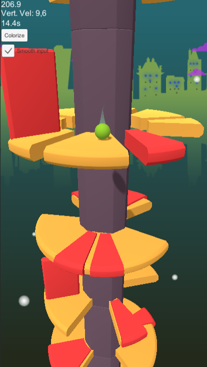

# Shredding Jump project

This project is an attempt to make clone of quite famous hyper-casual game "Helix Jump". Levels are generated automatically using some premade assets.

## Screenshots

## Controls

Simply swipe left or right to rotate tower. This game doesn't require any other actions from user. It's hyper-casual after all ^_^

## Install

1. Download this project.
2. Open in Unity 2021.3.3f1 or newer.
3. In the Project panel navigate to "Assets/Data/Scenes" folder and open SandboxLevel.unity.
4. Hit "Run" and enjoy the game!